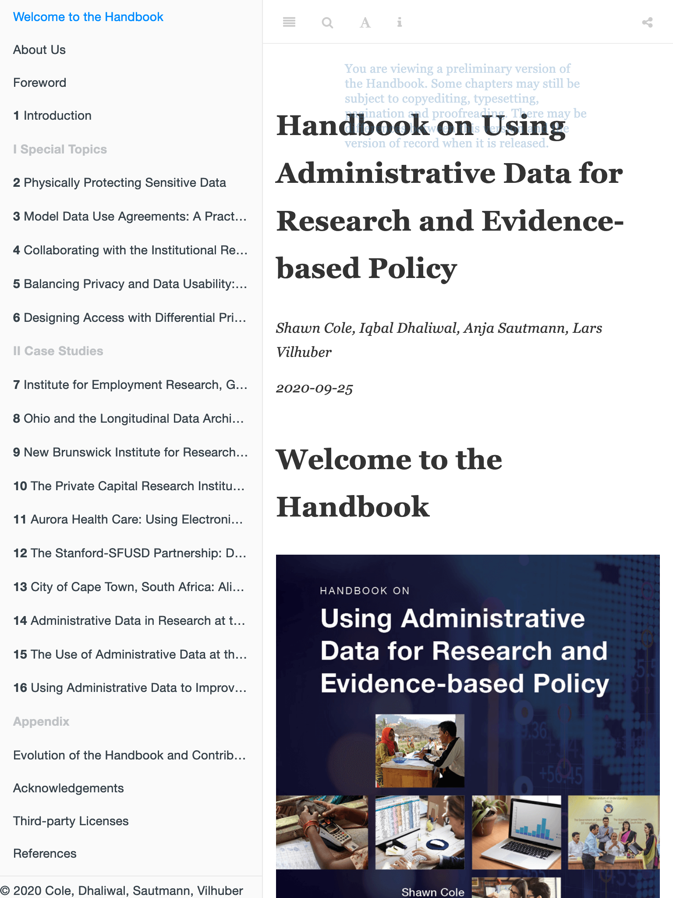

```{r setup, include=FALSE}
knitr::opts_chunk$set(echo = TRUE)
knitr::opts_chunk$set()
```

The online book allows for customization of the browsing experience, and will remember some settings. You will start with the **table of contents** expanded, so you can navigate the book:

{width=50%}

You can adjust the visibility of the table of contents by clicking on the menu button:

{width=30%}

The book should now adjust to any screen size:

{width=50%}

You can searching through the entire book by clicking on the search button:

{width=30%}


